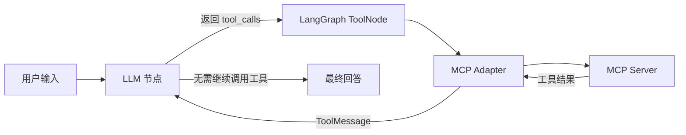

# MCP 多工具智能体

目前已实现 **LLM + LangGraph + MCP + 数据库 + Web Search**。数据库支持 SQLite 与 MySQL，搜索支持无需 Key 的 DDGS 和 Tavily API。使用 Python 3.11+，项目默认 Python 3.12。

**本轮新增能力、MySQL 跨电脑部署和配置说明见 [数据库与 Web Search](docs/database-and-search.md)。**

LLM 采用 OpenAI 兼容的 **Chat Completions** 接口。通过 `.env` 设置服务地址、模型和 Key；所选服务与模型必须支持 `tools` / `tool_calls`。本项目不使用 OpenAI 专属的托管 MCP 接口。

## 执行流程



默认三个 Server 通过 **stdio 子进程**运行，提供以下工具：

| 工具 | 功能 |
| --- | --- |
| `demo_add` | 两个有限数相加 |
| `demo_multiply` | 两个有限数相乘 |
| `demo_get_current_time` | 按 IANA 时区查询当前时间，默认 `Asia/Shanghai` |
| `database_database_info` | 当前数据库类型和只读状态 |
| `database_list_tables` | 列出数据表和视图 |
| `database_describe_table` | 查询字段和表结构 |
| `database_query` | 参数化只读 SQL，限制结果行数 |
| `web_search` | 返回网页标题、URL 和摘要 |

工具名加上 Server 名前缀，以支持多个 Server。工具列表来自真实 MCP 握手和发现流程，工具参数、执行结果也经过 MCP 传输。

## 快速运行

在项目根目录执行以下 PowerShell 命令（需要安装 [uv](https://docs.astral.sh/uv/getting-started/installation/)）：

```powershell
uv sync --locked
if (-not (Test-Path .env)) { Copy-Item .env.example .env }
uv run mcp-agent db-init
```

如果已有 `.env`，保留原文件并参照 `.env.example` 添加缺少的配置。首次运行时用 `db-init` 创建 SQLite 示例库；已有 `data/agent_demo.db` 时跳过，该命令不会覆盖已有文件。编辑 `.env` 中的三个字段：

```dotenv
LLM_BASE_URL=https://你的服务商的API地址/v1
LLM_MODEL=服务商提供的支持工具调用的模型ID
LLM_API_KEY=你的API密钥
```

`LLM_BASE_URL` 填服务商文档给出的 API 根地址，不要追加 `/chat/completions`。以服务商要求为准，并非所有服务都需要 `/v1`。`.env.example` 默认展示 OpenAI 官方 API 根地址，可以直接替换成兼容服务。

先检查 MCP，**此命令不需要 LLM Key**：

```powershell
uv run mcp-agent tools
```

无需 LLM Key 也可直接测试数据库和真实联网搜索：

```powershell
uv run mcp-agent call database_list_tables
uv run mcp-agent call database_query --args-file examples/database-query.json
uv run mcp-agent call web_search --args-file examples/web-search.json
```

再发起一次真实模型任务：

```powershell
uv run mcp-agent ask "请调用工具，先计算 3+5，再把结果乘以12。" --trace
uv run mcp-agent ask "请使用工具查询上海现在的时间。" --trace
uv run mcp-agent ask "查看数据库，按商品类别统计库存。" --trace
uv run mcp-agent ask "搜索 LangGraph MCP 文档并给出来源链接。" --trace
uv run mcp-agent chat --trace
```

`--trace` 在本轮结束后显示工具调用和结果。交互模式支持 `/reset` 清空当前上下文、`/exit` 退出；Ctrl+C 也可退出。

完成 `uv sync --locked` 后，也可以直接使用新建的虚拟环境执行：

```powershell
.\.venv\Scripts\mcp-agent.exe tools
.\.venv\Scripts\mcp-agent.exe chat --trace
```

macOS / Linux 使用相同的 `uv` 命令，把复制配置的命令替换为 `cp .env.example .env`。

## 项目结构

```text
config/mcp.servers.json        MCP Server 配置
src/mcp_agent/
  settings.py                 环境变量配置、参数校验
  llm.py                      OpenAI 兼容模型工厂
  mcp_client.py               MCP 配置加载、变量替换、工具发现
  graph.py                    LLM / tools 节点与条件路由
  cli.py                      tools / ask / chat 命令
  servers/demo.py             独立的 MCP 示例服务器
  database.py                 SQLite / MySQL 配置、只读查询和初始化
  web_search.py               DDGS / Tavily 搜索
  servers/database.py         数据库 MCP Server
  servers/web_search.py       搜索 MCP Server
tests/                        配置、模型协议、图循环和 MCP 集成测试
pyproject.toml                项目与依赖声明
uv.lock                       锁定完整依赖版本
```

## 增加 MCP Server

修改 `config/mcp.servers.json`，无需修改 LangGraph。当前默认注册 demo、database、web 三个 Server；以下是只启用 demo 的最小配置：

```json
{
  "mcpServers": {
    "demo": {
      "transport": "stdio",
      "command": "${PYTHON}",
      "args": ["-m", "mcp_agent.servers.demo"],
      "env": {"PYTHONIOENCODING": "utf-8"}
    }
  }
}
```

`${PYTHON}` 自动替换为当前虚拟环境解释器，避免子进程找错 Python。其他 `${VARIABLE}` 从系统环境或当前目录 `.env` 读取，系统环境优先；缺失变量会在连接前报错。

要接入已经运行的 HTTP MCP 服务，可在 `mcpServers` 内增加以下条目，并在 `.env` 填写 `REMOTE_MCP_TOKEN`：

```json
"remote": {
  "transport": "streamable_http",
  "url": "http://localhost:8000/mcp",
  "headers": {"Authorization": "Bearer ${REMOTE_MCP_TOKEN}"}
}
```

无需认证时删去 `headers`。服务地址是示例，需要替换为实际 MCP 端点。当前配置支持 `stdio` 和 `streamable_http`，不是任意协议的 HTTP API。

指定其他配置文件：

```powershell
uv run mcp-agent --mcp-config config/mcp.servers.json tools
```

`.env` 中的 `MCP_CONFIG_PATH` 可设置默认配置文件；未设置时使用内置三个 Server。相对路径基于当前工作目录。`stdio` 的 `cwd`、`args` 和 `env` 可按需配置，程序与脚本路径建议用绝对路径。新增的 `inherit_env` 字段可显式列出要从系统环境或 `.env` 传给子进程的配置；显式 `env` 的优先级更高。

MCP 配置属于可信本地配置，`command` 会启动程序。适配器每次工具调用创建并关闭会话，因此示例工具不依赖 Server 内存保存状态；未来需要有状态 Server 时，可在 `mcp_client.py` 改为显式管理 `client.session()` 生命周期。

## 运行边界与后续扩展

| 配置 | 默认值 | 作用 |
| --- | --- | --- |
| `LLM_TIMEOUT_SECONDS` | 60 | 单次模型请求超时 |
| `LLM_MAX_RETRIES` | 2 | 模型客户端重试上限 |
| `MCP_STARTUP_TIMEOUT_SECONDS` | 30 | MCP 工具发现超时 |
| `AGENT_TIMEOUT_SECONDS` | 120 | 一轮任务总超时，包含模型和工具 |
| `AGENT_RECURSION_LIMIT` | 20 | LangGraph 执行步数上限，防止无限循环 |
| `LLM_TEMPERATURE` | 不设置 | 可选，按服务商支持情况配置 |

工具执行错误会作为错误 `ToolMessage` 交回模型，允许修正参数；连接或传输异常会终止当前轮并提示错误。超时和失败的轮次不加入交互历史；对有副作用的远程工具，失败后应先核实执行结果再重试。

交互历史仅存在于当前进程，退出即丢失，当前没有持久化 Memory。后续能力的接入点：

| 后续模块 | 建议接入位置 |
| --- | --- |
| 数据库（已实现） | SQLite / MySQL 共用数据库 MCP 工具 |
| Web Search（已实现） | DDGS / Tavily 共用搜索 MCP 工具 |
| RAG | 增加检索工具，或在 `graph.py` 添加检索节点 |
| Memory | `build_graph(..., checkpointer=...)` 已支持注入检查点；后续增加会话 ID、数据库存储与长期记忆检索 |

RAG 和持久化 Memory 尚未实现。默认使用 SQLite，无需额外数据库服务；切换 MySQL 时，需要已有可访问的 MySQL Server。

## 验证

```powershell
uv run pytest -q
uv run ruff check src tests
uv run ruff format --check src tests
```

测试包括：多步调用和直接回答的路由、参数/工具错误与循环上限、配置校验、真实 MCP stdio 子进程、真实 ChatOpenAI 客户端的工具请求和回传格式。测试用受控模型或模拟 HTTP 响应，不需要 API Key，也不产生真实模型费用。真实服务商的模型效果和兼容性仍需填入自己的配置后验证。

新增测试覆盖真实 SQLite、数据库 MCP 调用、写入拒绝、SQL 参数绑定、MySQL 连接/事务模拟和搜索响应。MySQL 的自动测试使用模拟连接，部署时请另外验证真实 MySQL 连通性。

实现所参考的官方文档：[LangGraph Quickstart](https://docs.langchain.com/oss/python/langgraph/quickstart)、[LangChain MCP Adapter](https://reference.langchain.com/python/langchain-mcp-adapters)、[MCP Python SDK v1](https://py.sdk.modelcontextprotocol.io/v1/)、[ChatOpenAI](https://docs.langchain.com/oss/python/integrations/chat/openai)、[OpenAI Function Calling](https://developers.openai.com/api/docs/guides/function-calling)。
